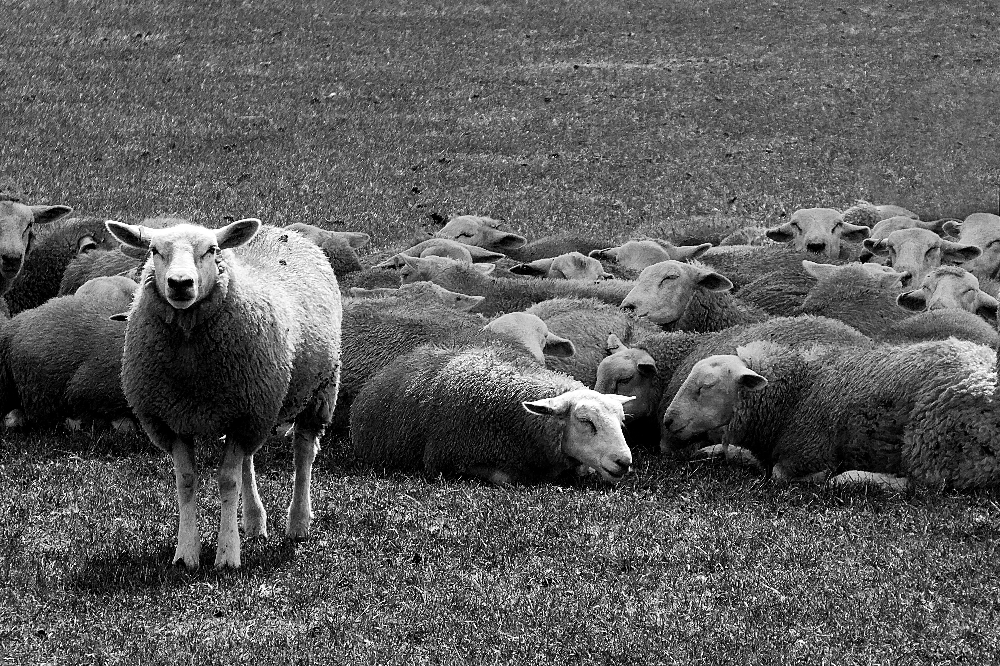
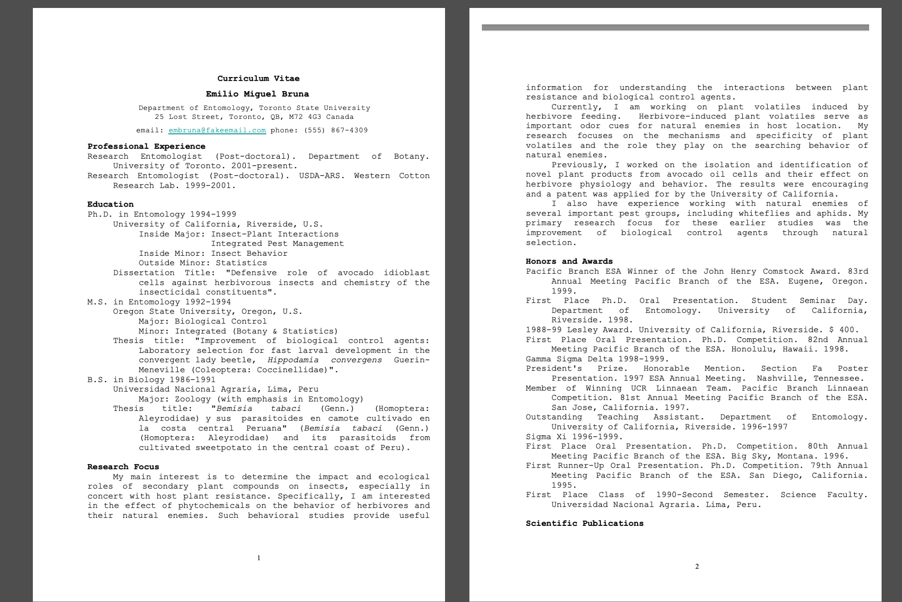
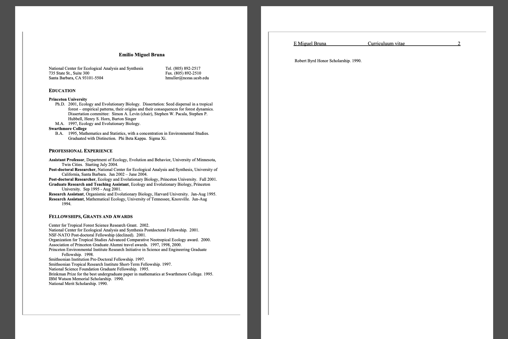
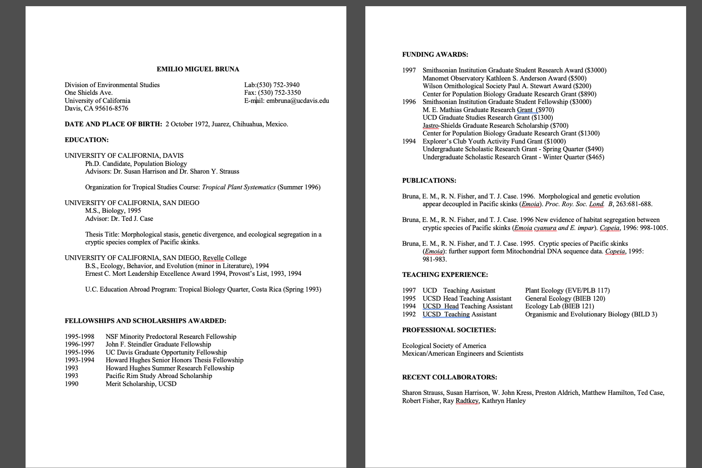
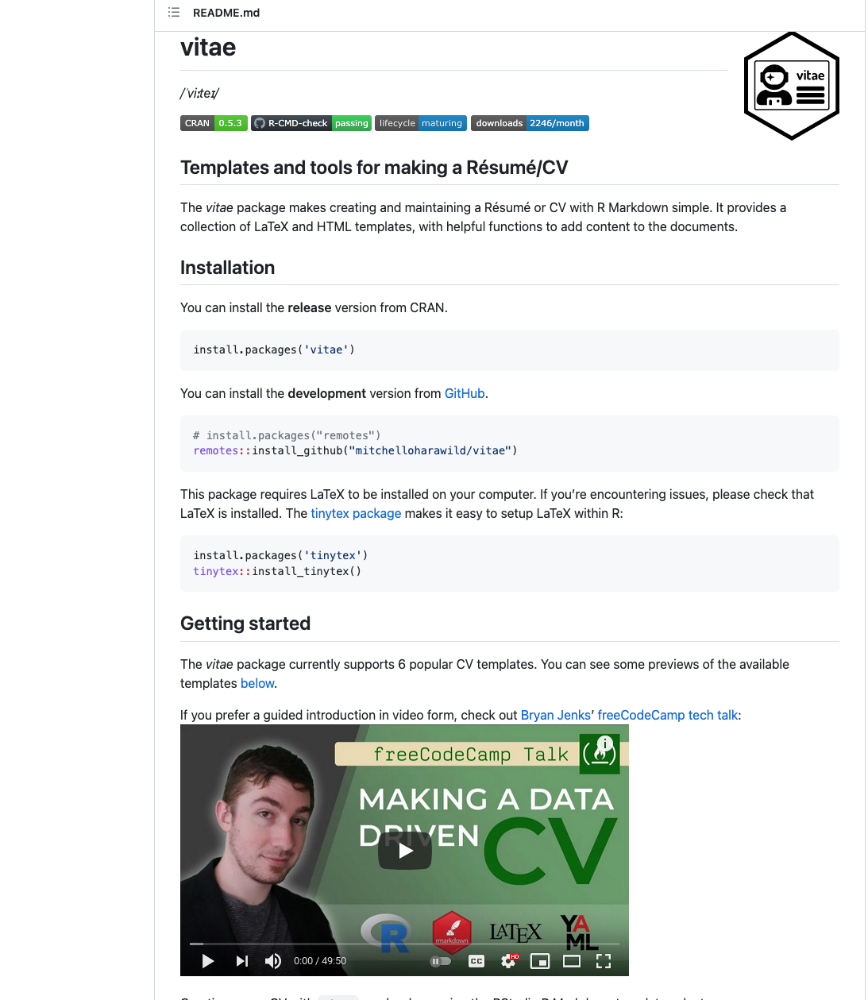
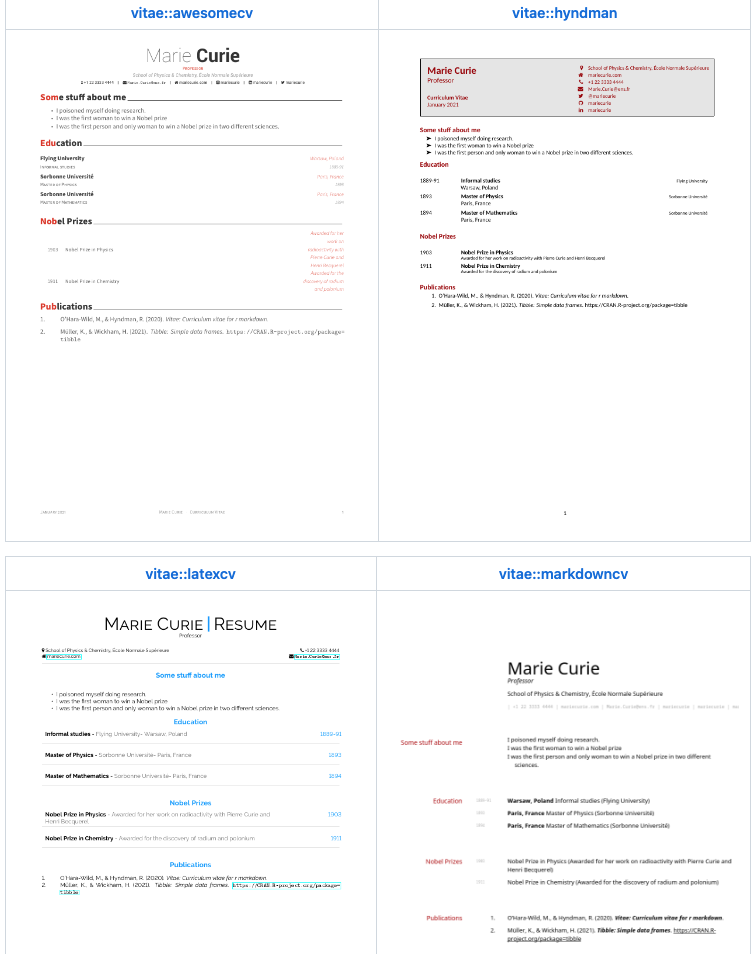
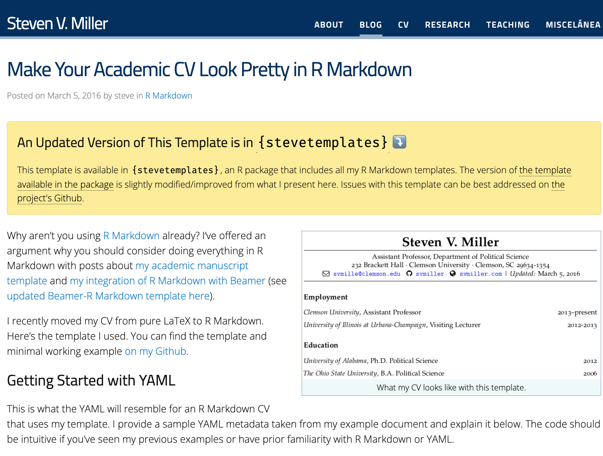
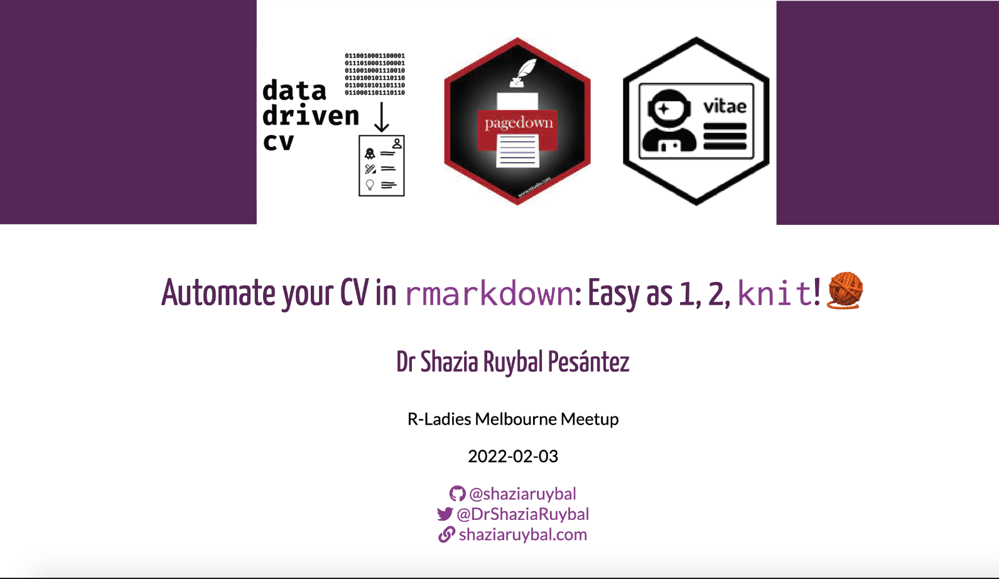
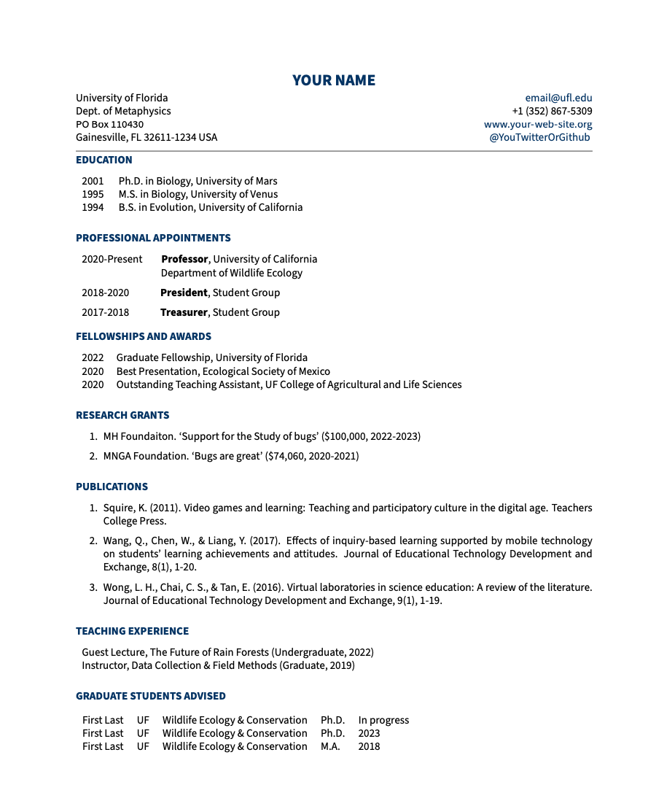
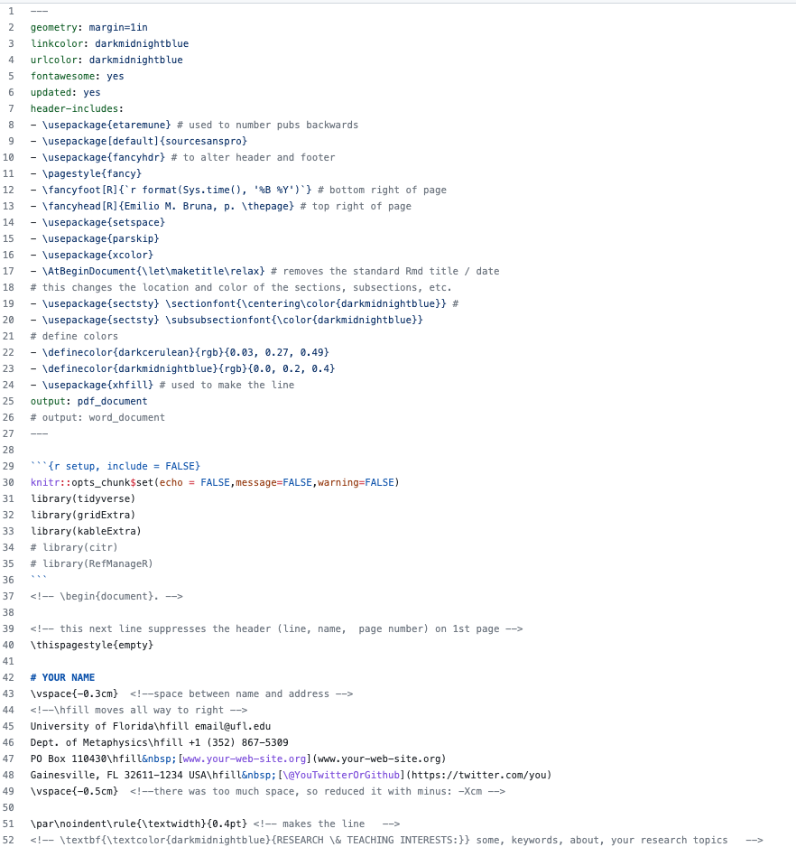

## [Before we start]{style="color: darkblue"} {.smaller}

These Slides can be found at: 

[`github.com/BrunaLab/cv_workshop`](github.com/BrunaLab/cv_workshop)  

or   

[`https://brunalab.github.io/cv_workshop/slides/index.html`](https://brunalab.github.io/cv_workshop/cv_workshop.html)

------------------------------------------------------------------------

## [What is a *CV* and what is it for?]{style="color: darkblue"}

{.absolute left="0"}

{.absolute right="0"}

------------------------------------------------------------------------

## [What do **_others_** need from your *CV* ?]{style="color: darkblue"} {.smaller}

1.   **Who are you?** 

2.  **How can we contact you?**

3.   **What have you done?**

------------------------------------------------------------------------

## [What do **_you_** need from your *CV* ?]{style="color: darkblue"} {.smaller}

------------------------------------------------------------------------

## [How do you do that?]{style="color: darkblue"} {.smaller}

### _Content_, _Organization_, _Creativity_...

------------------------------------------------------------------------

<!-- ## [How do you do that?]{style="color: darkblue"} {.smaller} -->

### ...and know your audience.

::: columns
::: {.column width="50%"}
-   **Name & contact info**

-   **Educational background**

-   **Awards, scholarships, fellowships**

-   **Grants**

-   **Publications**

-   **Teaching Experience**
:::

::: {.column width="50%"}
-   **Extension / Outreach Activities**

-   **Presentations**

-   **Professional service**

-   **Relevant professional memberships**

-   **Professional Development/Training**

-   **Other Stuff**
:::
:::

<!-- . . . -->

<!-- ::: noncolumn -->
<!-- ::: {style="position: absolute; bottom: 0; right: 0; width: 300px; text-align:right;"} -->
<!-- [**Know your audience.**]{style="color: darkblue"} -->
<!-- ::: -->
<!-- ::: -->

------------------------------------------------------------------------

## [What goes in each category?]{style="color: darkblue"} {.smaller}

<!-- ::: {.nonincremental} -->

::: columns
::: {.column width="50%"}
-   **Name & contact info**

    -   [*webpage, google scholar, github?*]{style="color: darkgray"}
    -   [*Citizenship or immigration status?*]{style="color: darkgray"}

-   **Educational background**

    -   [*Advisors? Thesis titles?*]{style="color: darkgray"}

-   **Awards, scholarships, fellowships**

-   **Grants**

-   **Publications**

    -   [*Peer-reviewed, non-peer-reviewed, technical reports, theses*]{style="color: darkgray"}
:::

::: {.column width="50%"}
-   **Teaching Experience**

    -   [*TA, Guest Lectures, Environmental Ed.*]{style="color: darkgray"}

-   **Extension / Outreach Activities**

-   **Presentations**

    -   [*Invited vs. submitted, posters*]{style="color: darkgray"}

-   **Professional service**

-   **Relevant professional memberships**

-   **Professional Development/Training**

-   **Other Stuff**
:::

<!-- ::: -->
:::

------------------------------------------------------------------------

## [What is 'Other Stuff'?]{style="color: darkblue"} {.smaller}

::: columns
::: {.column width="50%"}
Technical Skills  
Language Skills  
Presentations  
'Named' Scholarships & Fellowships  
Certifications & Licenses  
Foreign Study  
International Experience  
Programming Skills  
Reviewer for Journals  
Editorial Boards  
Exhibits  
Organizing events *(e.g., this workshop)*  
:::

::: {.column width="50%"}
Areas of Expertise  
Internships  
Academic Interests  
Administrative Experience  
Supervisory Experience  
Consulting Experience  
Advising  
Outreach  
Advisory Committees  
Guest Lectures in Courses  
Patents  
:::
:::

::: noncolumn
::: {style="position: absolute; bottom: 0; right: 0; width: 900px; text-align:right;"}
[**The categories, and what you include in each, changes over time.**]{style="color: darkblue"}
:::
:::

------------------------------------------------------------------------

## [*CV* aesthetics]{style="color: darkblue"} {.smaller}

-   **CLEAR**

    -   [*Well-organized, readable, visually appealing, error free*]{style="color: darkgray"}
    -   [*name & number all pages*]{style="color: darkgray"}

-   **CONCISE**

    -   [*Don't pad, avoid lengthy entries*]{style="color: darkgray"}

-   **COMPLETE**

    -   [*Everything relevant to your audience*]{style="color: darkgray"}

-   **CONSISTENT**

    -   [*Styles, fonts, formats, chronological order*]{style="color: darkgray"}

-   **CURRENT**

    -   [*dates, update ~~regularly~~ immediately*]{style="color: darkgray"}

::: {style="position: absolute; bottom: 0; right: 0; width: 400px; text-align:right;"}
[**Let's see some examples.**]{style="color: darkblue"}
:::

------------------------------------------------------------------------

<!-- ##  -->

{fig-align="left"}

------------------------------------------------------------------------

<!-- ##  -->

{fig-align="left"}

------------------------------------------------------------------------

{fig-align="left"}

------------------------------------------------------------------------

## [Resources & Tutorials]{style="color: darkblue"}

------------------------------------------------------------------------

##  {.smaller}

`vitae` package\
[`github.com/mitchelloharawild/vitae`](https:\\github.com/mitchelloharawild/vitae)

{fig-align="center"}

------------------------------------------------------------------------

{fig-align="center"}

------------------------------------------------------------------------

##  {.smaller}

Stephen V. Miller's CV Template\
[`svmiller.com/blog/2016/03/svm-r-markdown-cv`](https:\\svmiller.com/blog/2016/03/svm-r-markdown-cv)

{fig-align="center"}

------------------------------------------------------------------------

##  {.smaller}

Tutorial by Dr. Shazia Ruybal Pesántez\
[`github.com/shaziaruybal/automate-cv-rmd`](https:\\github.com/shaziaruybal/automate-cv-rmd)

{fig-align="center"}

------------------------------------------------------------------------

## [EMB: old School .Rmd + LaTeX = .pdf]{style="color: darkblue"} {.smaller}

[`github.com/BrunaLab/cv_template`](https:\\github.com/BrunaLab/cv_template)

{.absolute left="0"}
{.absolute right="0"}

------------------------------------------------------------------------
